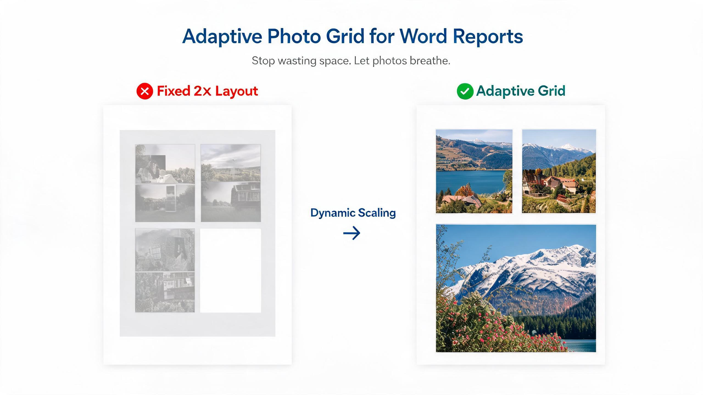

# python-docx-photo-grid · Word 自適應相片排版

<div align="center">



**Word report generation with adaptive 2-column photo grid algorithm**

A4 geometry · MD5 dedup · Caption generation · Full helper library

[快速開始](#快速開始) · [文件結構](#文件結構) · [技術棧](#技術棧)

</div>

---

> Python-based Word (.docx) 報告生成，配**自適應 2 欄相片網格**算法。解決「固定 2×2 佈局浪費空間」嘅經典問題，按每頁實際行數動態縮放相片。

## 解決什麼問題

生成有大量相片嘅 Word 報告時：
- 固定 2×2 排版，行數少時相片太細、浪費空間
- 手動拖相對位，幾十張相搞幾個鐘
- 不同報告（燈具/Lux/風扇）格式唔統一
- caption 編號、頁碼、簽署區每次重複做

**python-docx-photo-grid** 將呢啲全部自動化。

## 核心特性

### 🖼️ 自適應相片網格算法
- 最多 3 行 × 2 欄 = 6 張/頁
- 按每頁實際相片數量動態縮放
- A4 / Letter 頁面幾何常數精準計算
- 長寬比自動適配，唔變形

### 📸 相片處理管線
- MD5 相片去重（重複相自動跳過）
- 圖片壓縮（控制文件大小）
- caption 自動生成（避開 `_01` 後綴 bug）

### 📋 完整 Helper 庫
- 字體設定（中英文混排）
- 表格邊框樣式
- 頁碼 + 頁眉抬頭圖
- 統一簽署區塊

### 🧪 驗證工具
- 結構完整性檢查腳本
- 17 個 documented pitfalls

### 🏗️ 工程竣工報告模板
適用於工程各類圖文並茂測試竣工報告
（統一藍色系 + 承建商抬頭圖 + 章節結構）

> 🔒 **工程竣工報告模板與SOP** 為非公開內容，不在此公開 repo 中。
> 包含完整模板、排版規格、SOP 流程、實機交付件參數。
> 如需商業使用，請郵件聯絡：**david_1999cn@hotmail.com**

## 適用場景

| 場景 | 例子 |
|:---|:---|
| 竣工/驗收/測試報告 | 燈具/Lux/風扇/電箱/設備驗收 |
| 巡查/勘察記錄 | 現場勘察備忘錄、質量檢驗報告 |
| 任何「文字+大量相片」報告 | 施工日誌、售後報告、工作總結 |
| 需要相片排版靚 | 標書附件、客戶報告、年報 |

**唔適用**：純文字文檔；修改現有 docx（用 officecli-workflow）；表格數據為主。

## 文件結構

```
python-docx-photo-grid/
├── README.md                          # 本文件
├── DOCUMENTATION.md                   # 完整技能文檔
├── assets/
│   └── photo-grid-comparison.jpg      # 效果對比圖
├── references/
│   └── 竣工報告三件套_模板與SOP.md 🔒 # 模板 & SOP 參考（非公開，需郵件授權）
└── scripts/
    └── adaptive_photo_grid.py         # 可重用程式碼模組
```

## 技術棧

- **Python** + **python-docx** — Word 文檔生成
- **Pillow** — 圖片處理與尺寸計算

## 快速開始

```python
from adaptive_photo_grid import PhotoGridBuilder

builder = PhotoGridBuilder(page_size="A4", columns=2, max_rows=3)
builder.add_photos(["photo1.jpg", "photo2.jpg", "photo3.jpg"])
builder.save("report.docx")
```

詳細用法請參閱 [DOCUMENTATION.md](DOCUMENTATION.md)。

---

## License

MIT License — feel free to use, modify, and share.
